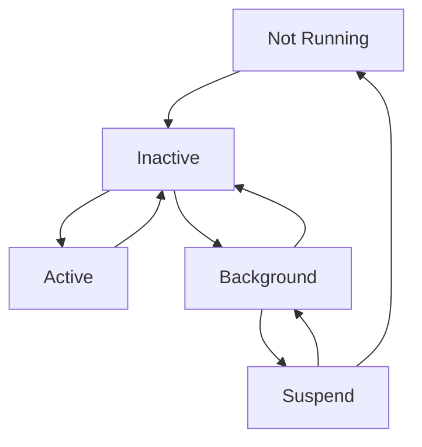
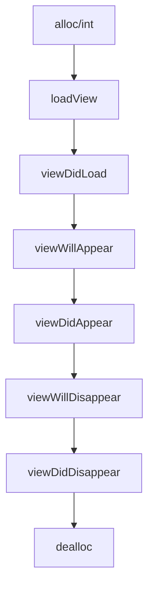

# iOS学习homework

### App、ViewController生命周期各个事件：

#### APP:

#### ViewController:

### 常用UI控件：

UIScrollView

UITableView

UICollectionView

UIWebView

WKWebView

### UITableViewDelegate声明方法：

\- (CGFloat)tableView:(UITableView *)tableView heightForRowAtIndexPath:(NSIndexPath *)indexPath

\- (UIView *)tableView:(UITableView *)tableView viewForHeaderInSection:(NSInteger)section

\- (NSString *)tableView:(UITableView *)tableView titleForHeaderInSection:(NSInteger)section

\- (CGFloat)tableView:(UITableView *)tableView heightForHeaderInSection:(NSInteger)section

\- (NSString *)tableView:(UITableView *)tableView titleForFooterInSection:(NSInteger)section